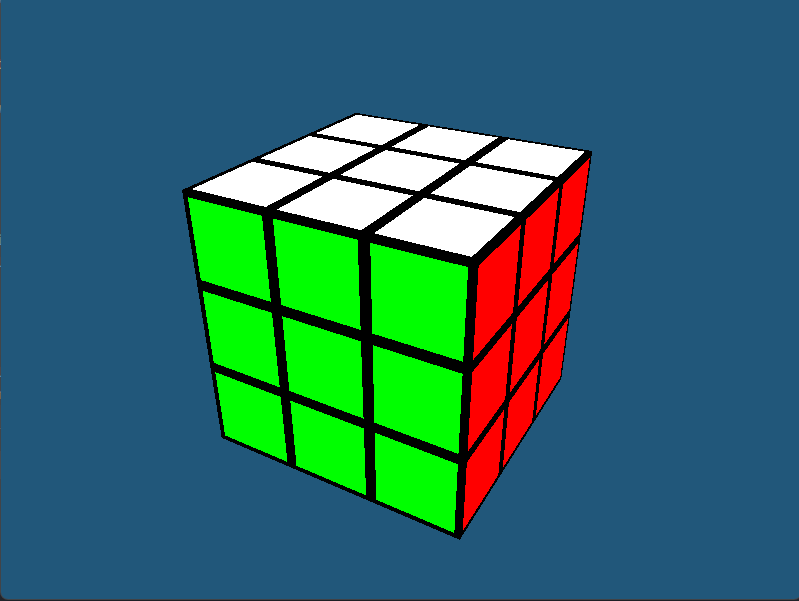

# Rubik's Cube

A simple Rubik's cube simulator with console interface and 3D graphics implemented using OpenGL 3.3

Note that for solution a genetic algorithm is used, which is not reasonable (yet amusing) approach to the Rubik's Cube puzzle and hence finds far-from-optimal solution in relatively long time

## Preview

## Controls
- Use **arrow keys** for camera rotation

- For cube turns use keys **F B L R U D M E S X Y Z** respective to conventional move notation (https://ruwix.com/the-rubiks-cube/notation/)

- For counterclockwise turns hold **left shift**

- Press **Enter** to solve from current state
